# 1.添加资产

# 2、怎么迁移资产

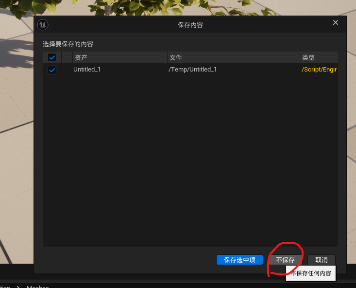

必须选择这个路径
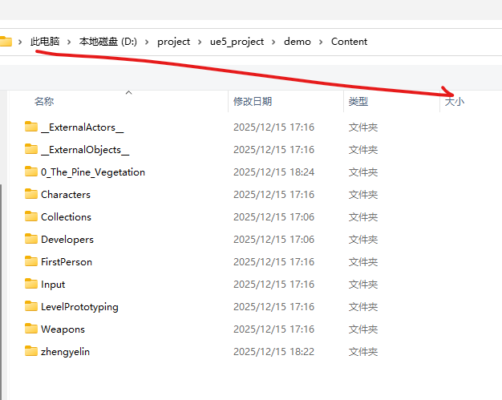

# 通过数字修改模型位置

1、选中模型，然后按 F4

# 坐标位置

# 创建关卡设置光源
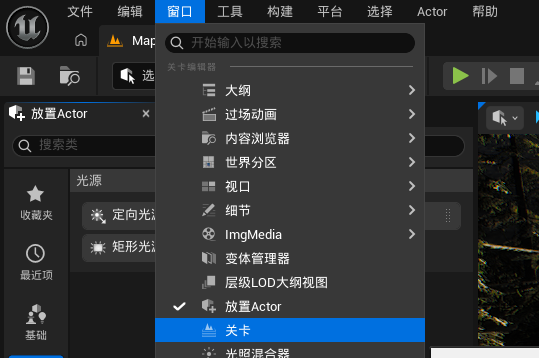

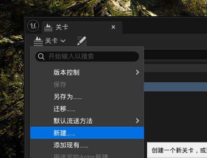

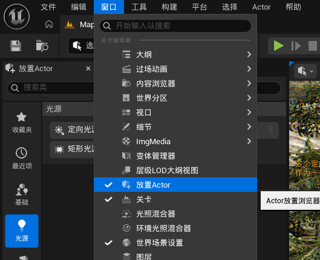
1、选中模型，然后按 F4设置光照属性、

# 删除模型，选中直接按delete键

# 隐藏关卡

# 创建材质球
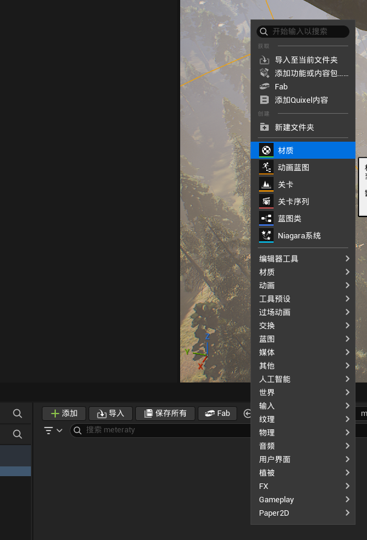
双击材质球
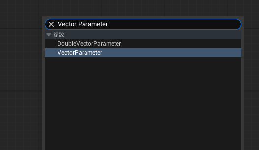

快速创建颜色节点，先按住键盘的v，然后点击鼠标左边
快速创建常量，先按住键盘的1，然后点击鼠标左边

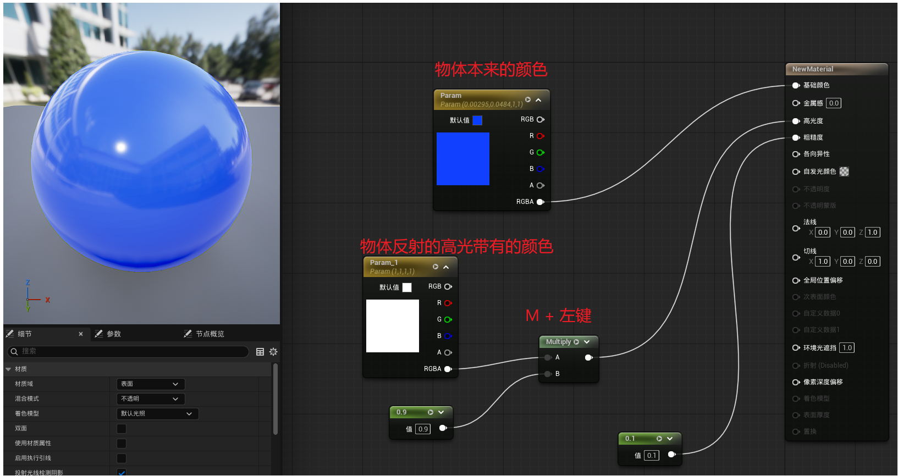

# 移动物体按住sheet键，视角可以跟随物体移动

# 选中物体，按下f键，将物体进行居中显示

# 切换视图的显示，alt+2, alt+3, alt + 4
2.ALT+2：切换到线框模式，场景以线框模式显示。
3.ALT+3：切换到无光模式，无光照效果。
4.ALT+4：切换到光照模式，带光照效果。
5.ALT+5：切换到细节光照模式，查看光照贴图黑白灰关系。
6.ALT+6：切换到光轴关系模式，查看光轴关系。

# 切换视图的方向
1.ALT+H：切换到前视图。
2.ALT+SHIFT+H：切换到后视图。
3.ALT+J：切换到顶视图。
4.ALT+SHIFT+J：切换到底视图。
5.ALT+K：切换到左视图。
6.ALT+SHIFT+K：切换到右视图。
7.ALT+G：切换到透视图。

# 按下G键可以切换到游戏视图模式
过滤掉不必要的反射捕捉器、灯光和相机，更直观地观察场景效果

# 按住ALT+C键可以切换物件的碰撞显示
便于观察碰撞是否正确。

# 编译时反射捕获 = 材质编译的同时，自动刷新场景反射效果
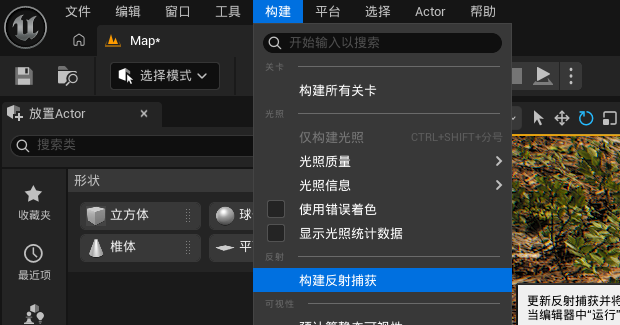

# 阴影可以锐化，模糊，设置阴影与物体的距离
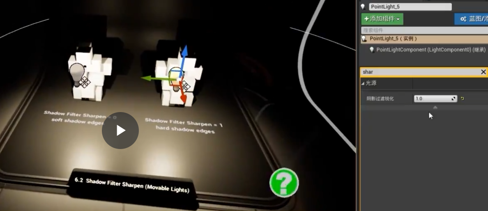

# 材质之间可以互相继承

# 怎么贴图

# 显示选中Actor细节的快捷键是f4

# 选择Actor和非Actor类型
1.选择所有使用选中静态网格体的资产的快捷键是shift e。
2.选择所有非Actor类型的资产的快捷键是ctrl shift+a。
3.允许选择半透明对象的快捷键是t。

# 材质蒙版基础
1.材质蒙版类似于Photoshop中的蒙版，用于控制材质的透明度和显示区域。
2.不透明蒙版基于红色通道，黑色表示透明，白色表示不透明。
3.通过调整蒙版，可以实现特定的遮罩效果。

# 什么是烘焙
✅ 大幅提升游戏运行性能
✅ 获得接近真实的光影效果
✅ 降低GPU负担
❌ 但烘焙的物体不能移动（移动了光影就不对了）

# uv是啥
一句话记忆：普通UV可以"偷懒"让相同部分共用，
Lightmap UV必须"诚实"给每个面独立空间记录它独特的光照。

### 为什么3D模型不一定有UV？
1. 建模时可能没做UV
有些模型只是几何体，建模师没展开UV
程序化生成的模型（如UE5中的基础几何体）可能没UV
快速原型制作时经常跳过UV步骤
2. 有UV ≠ 有合适的UV
这是关键！模型可能有UV，但：
UV Channel 0：普通贴图UV（通常有）
UV Channel 1：Lightmap专用UV（经常没有）

# 举个例子普通UV和Lightmap UV能做到和不能做到的点
普通UV可以"偷懒"让相同部分共用，Lightmap UV必须"诚实"给每个面独立空间记录它独特的光照。

# 烘焙完成之后，后续打包游戏就是自动应用烘焙了是吗，而且烘焙我只能选中一个物体进行烘焙
第一个问题：打包后会自动应用烘焙吗？
是的！ ✅ 烘焙完成后：

烘焙数据自动保存

生成的Lightmap会保存在项目文件中
路径通常在：Content/Maps/YourMapName_BuiltData.uasset
✅ 打包自动应用：烘焙完就自动保存，打包时自动包含
❌ 不是单个物体：Build Lighting会烘焙场景中所有Static物体
💡 提示：如果只想测试某个物体的Lightmap效果，可以：

把其他物体临时改成Movable
烘焙
再改回来

但通常没必要这么做，直接烘焙整个场景就好！
明白了吗？还有哪里不清楚？

# 介绍这些操作怎么做即可
材质槽 (Material Slots)

作用：指定模型不同部分使用的材质
不设置：模型会使用默认材质，看起来是灰色的

Nanite设置
启用Nanite支持

作用：开启虚幻5的高精度几何体系统，自动LOD
不开启：使用传统LOD，高面数模型性能差

重式切线 / 描绘UV

作用：保留特定数据用于材质计算
不勾选：某些材质效果可能不正常

位置精度 / 法线精度

作用：控制几何数据的压缩质量
自动：引擎自动选择最佳平衡

最小距离（屏幕尺寸）

作用：物体在屏幕上多小时停止细化
完整：始终保持最高细节，性能消耗大

保持三角形百分比

作用：简化时保留多少原始三角形（100.0 = 不简化）
降低：性能提升但质量下降

修剪相对误差

作用：允许的几何误差容忍度
0.0：最精确，文件更大

生成网格距离场 / 回退目标 / 源导入文件名

这些是辅助功能，通常保持默认即可

重换UV通道 / 重换贴图

作用：重新生成光照贴图UV
不设置：使用现有UV或可能光照错误

最大边长系数

作用：控制三角形大小上限
影响：防止出现过大的三角形

形状保留

Preserve Area：优先保持表面积
影响：简化时的质量策略

总结：大部分参数保持默认就行。核心是开启Nanite（自动优化性能），100.0保持三角形（保证质量），其他让引擎自动处理即可。

 
# ue5烘焙设置

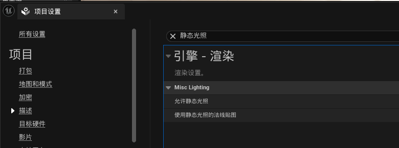
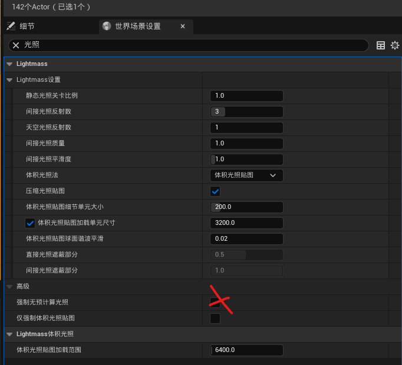
构建完成之后还要点击一个应用

# 输出日志

# 在大地图中选择一个物体很难，需要shift+3

# 贴图的基本概念

你至少要有这 3 张（名字可能不同）：

BaseColor（颜色贴图）

Normal（法线贴图，紫色那种）

Height / Displacement / Depth（高度贴图，黑白）

| 贴图文件名                                   | 贴图类型                      | UE5 中接到的属性            | 主要作用                | 新手注意事项                        |
| --------------------------------------- | ------------------------- | --------------------- | ------------------- | ----------------------------- |
| `Ground037_1K-PNG_Color.png`            | BaseColor（颜色）             | **Base Color**        | 决定地面/材质的**颜色外观**    | ✅ **sRGB 要开启**；只负责颜色，不管凹凸     |
| `Ground037_1K-PNG_NormalDX.png`         | Normal（法线，DX）             | **Normal**            | 制造“假凹凸”，骗光照方向       | ⚠️ **一定用 DX 版**；sRGB 要关       |
| `Ground037_1K-PNG_Roughness.png`        | Roughness（粗糙度）            | **Roughness**         | 控制反光程度：白=粗糙，黑=光滑    | ❌ sRGB 要关；太黑会像湿地              |
| `Ground037_1K-PNG_Displacement.png`     | Height / Displacement（高度） | **Parallax → Height** | 制造“假深度 / 视差”效果      | ❌ sRGB 必须关；值太大会晃              |
| `Ground037_1K-PNG_AmbientOcclusion.png` | AO（环境遮蔽）                  | **Ambient Occlusion** | 加强缝隙阴影              | ⚠️ UE5 + Lumen **新手先别用**，容易变黑 |
| `Ground037_1K-PNG_NormalGL.png`         | Normal（法线，GL）             | ❌ 不用                  | 给 Unity / Blender 用 | ❌ UE5 用了会凹凸反了                 |
| `Ground037.png`                         | 预览球                       | ❌ 不用                  | 网页展示用               | ❌ 不导入 UE5                     |

### 新手最容易踩的坑（再次强调）
| 错误             | 后果        |
| -------------- | --------- |
| 用 NormalGL     | 凹凸方向反，看着怪 |
| Height 开了 sRGB | 深度乱跳、边缘晃  |
| AO 直接接上        | 近看发黑      |
| Height 值调太大    | 画面像在流动    |

### 一句话帮你彻底记住
颜色决定“长什么样”
法线决定“光怎么打”
高度决定“看起来有多深”
粗糙度决定“亮不亮”

