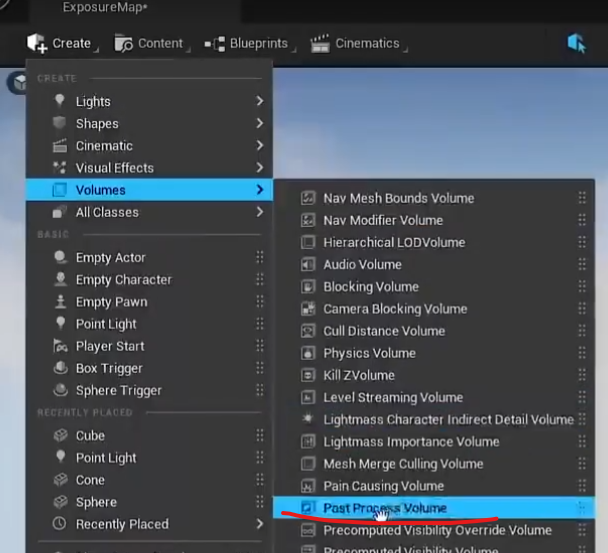
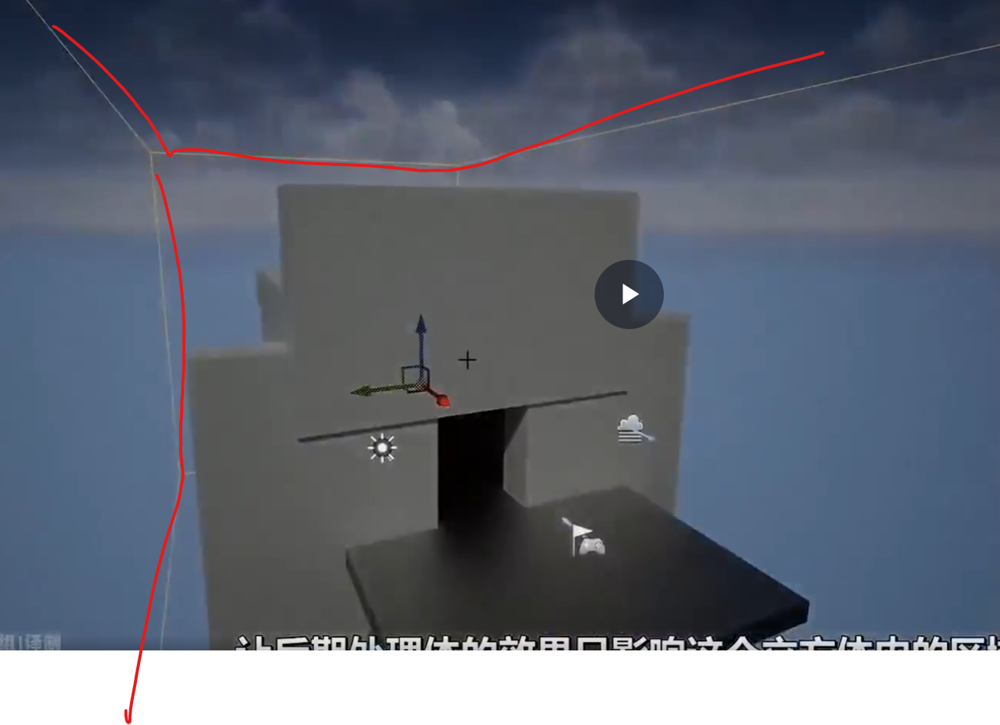
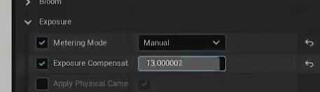
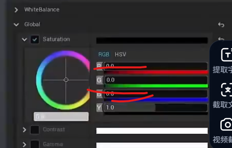
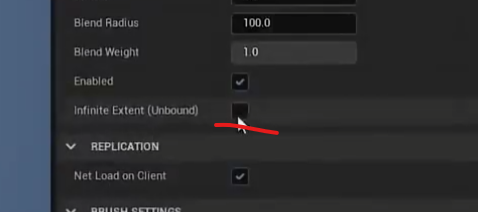
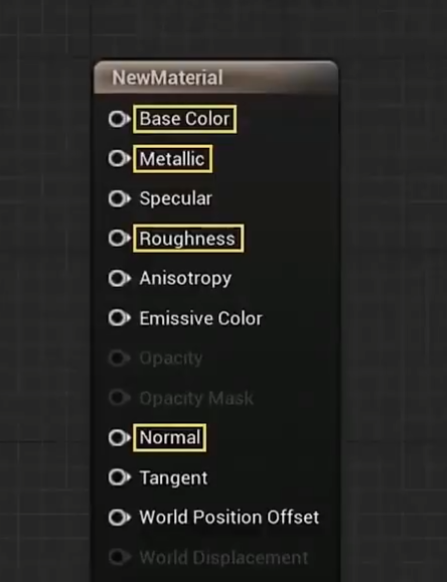
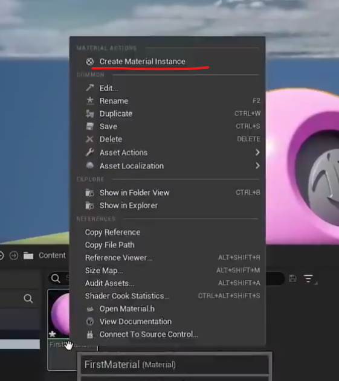
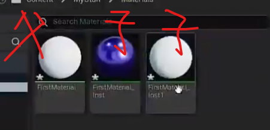
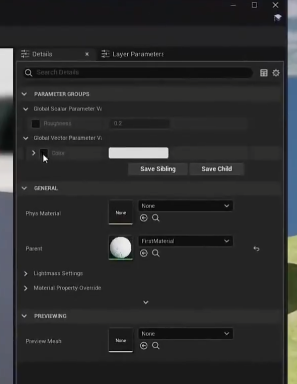

# 选中图片，按F，可以快速定位

# 自动曝光
- 会遇到摄像头亮度自动调整的问题，这是由于自动曝光功能默认开启导致的。
- 自动曝光模拟人眼瞳孔调节，根据光线亮度调整瞳孔大小。
- 可以通过关闭自动曝光并使用手动曝光控制来解决问题。
- 编辑模式下关闭自动曝光，但是在游戏模式下还存在
- 使用后处理体积来控制曝光，可以在渲染动画或游戏时应用。  

立方体包住整个场景  

指名是游戏模式下  

修改颜色基调  

如果想影响整个世界就勾选这个  

# 在大部分情况下只使用这种材质

# 创建材质的多种变体   
右键创建材质的多种变体  
  
将创建出来的材质应用给新的模型，然后就可以直接调了   

