# 使用别处的材质

# 1.直接拖动图片给软件

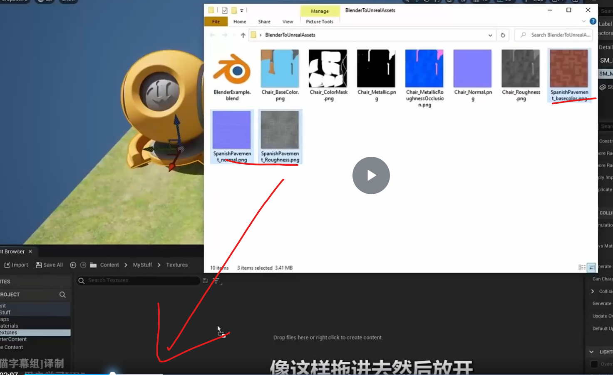

# 2.ue5有点聪明，可以根据颜色识别哪些是法线贴图
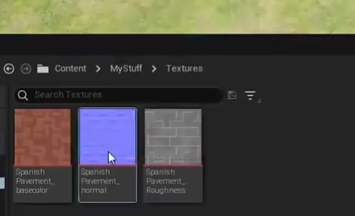

# 法线贴图关键配置
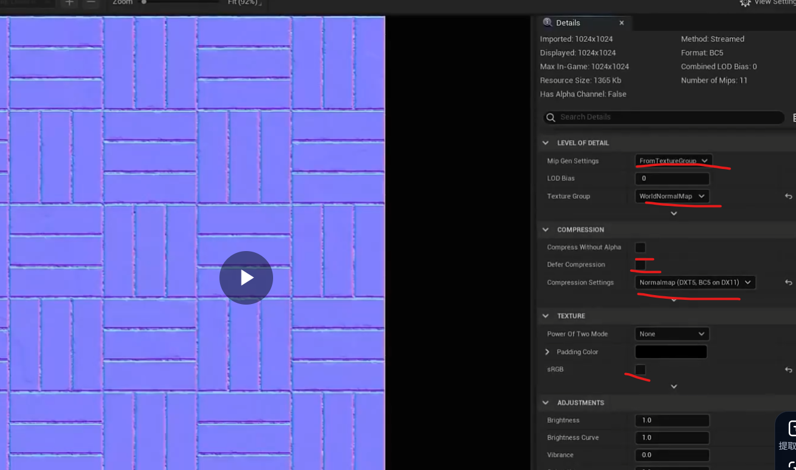

# 确保sRGB打开
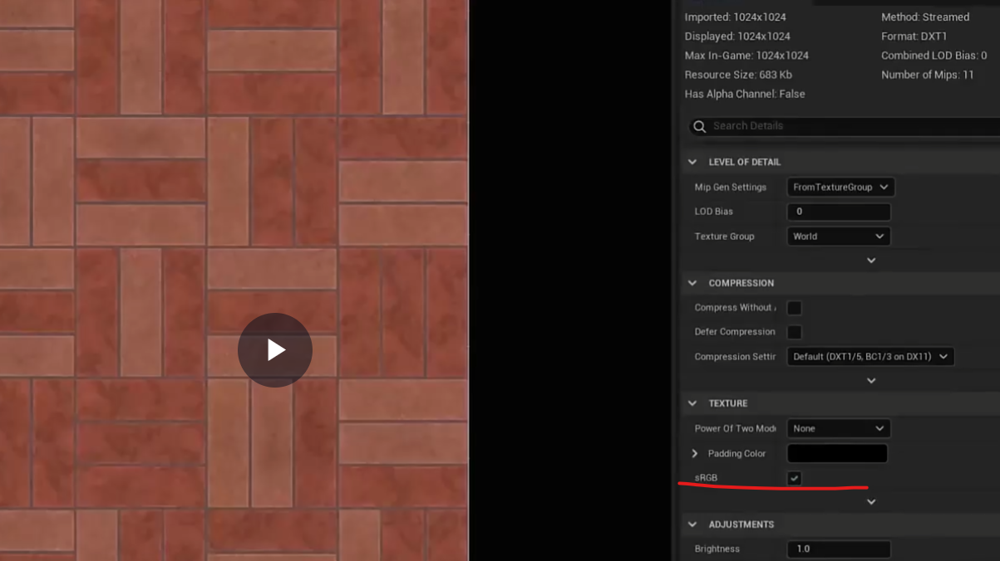

# 遮罩层确保去掉
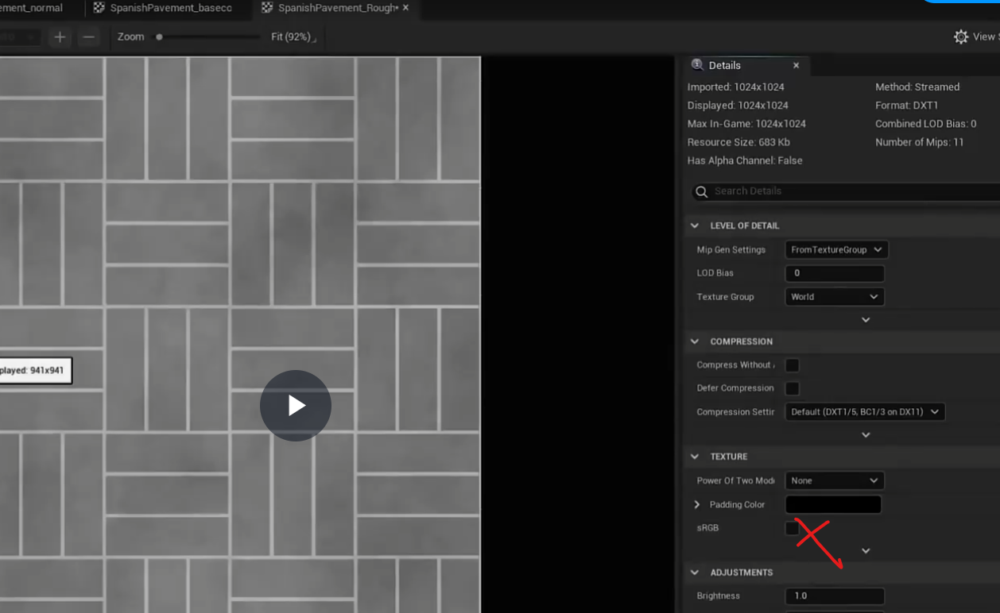

# 创建一个人行道材质
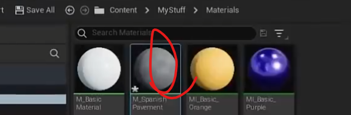

# 双击打开材质，然后选择三个纹理直接拖进去

# 颜色贴图自动设置成color
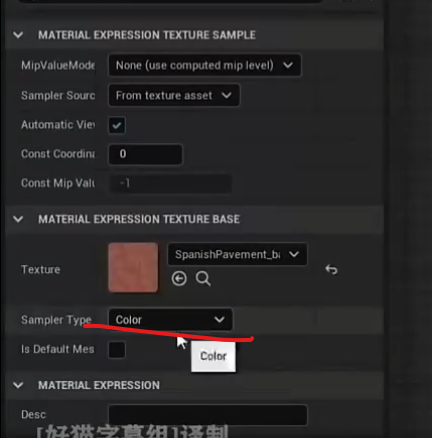

# 这里是线性color

# 蓝色默认是法线模式

# 放到地板上我们发现很密集

# 我们希望可以创建一些参数  
允许用户去调整贴图的长宽，TexCoord 永远只输出两个数字 (U, V)

用一个参数控制材质的参数细节

# 1.法线图转换：Blender使用OpenGL法线图，而Unreal Engine使用DirectX法线图。
2.转换方法：通过翻转绿色通道来转换法线图，确保阴影和法线方向正确。
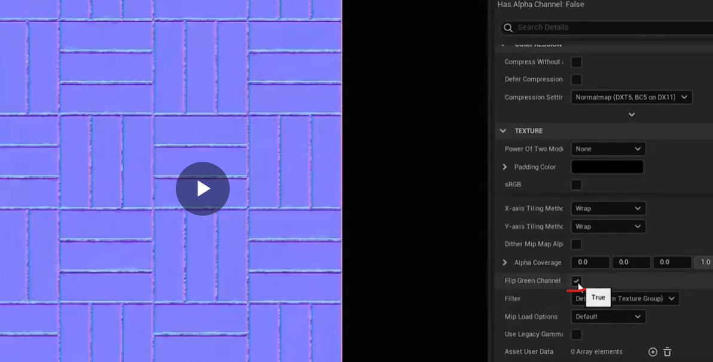

# 进一步优化，横向坐标和纵向坐标都可以设置材质大小

# 控制贴图的位置

# 继续优化，增强法线的凹凸强度

# 调整贴图颜色
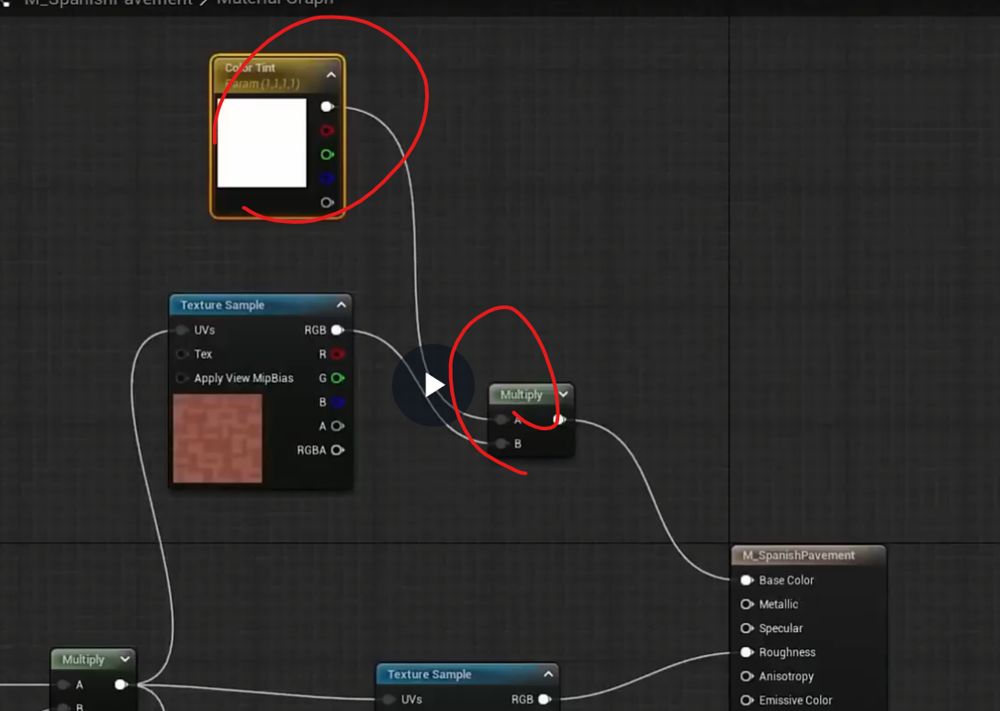

# 将贴图全部转换成参数
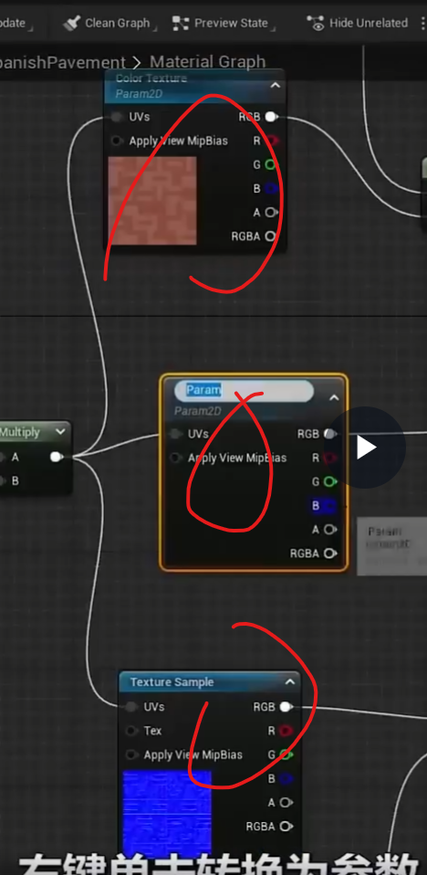

# 金属材质
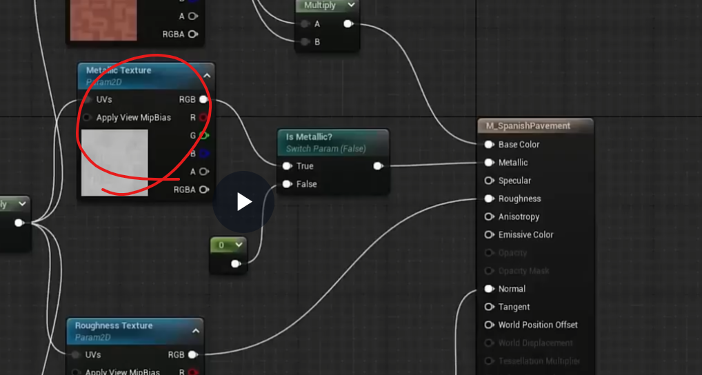
勾选就可以设置材质
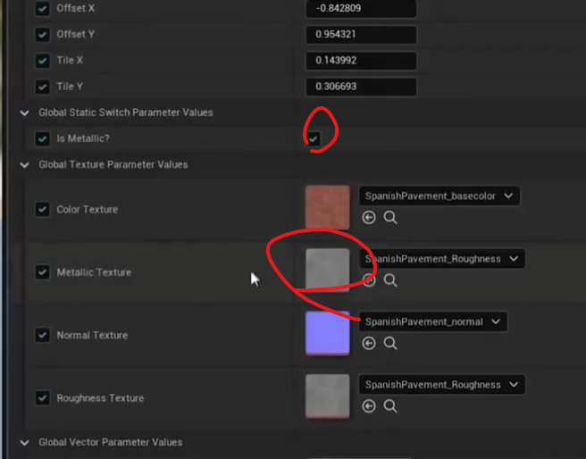