# 选择这种可以编辑的网格
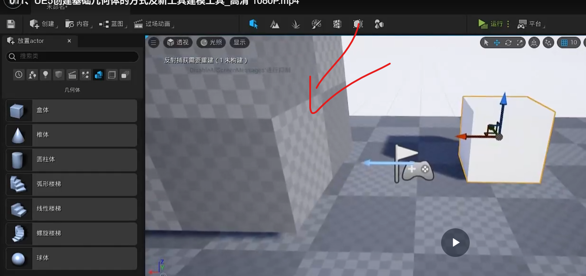

# 可以直接编辑网格体
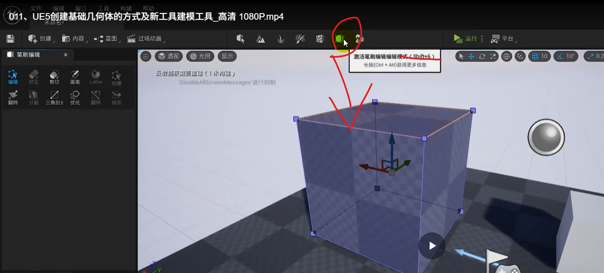

# 选择一个面，变成一个三角部分，然后可以拖动
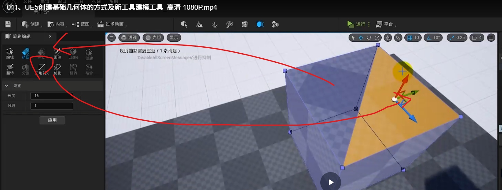

# 然后再进行编辑
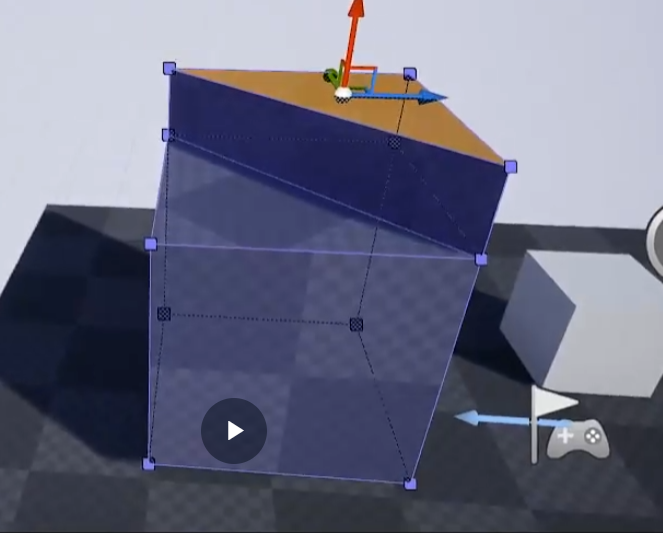

# 选择挤压可以拖动多次
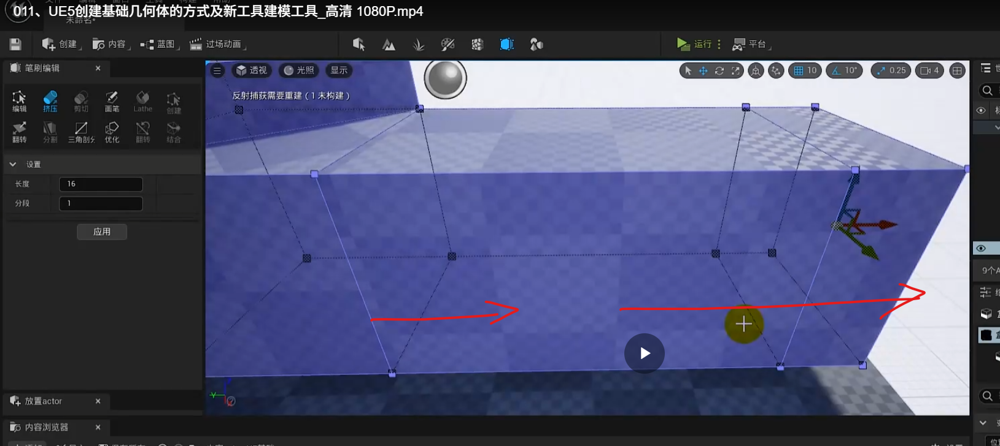

# 选择一个盒体然后选择一个属性，就会产生互相抵消的效果
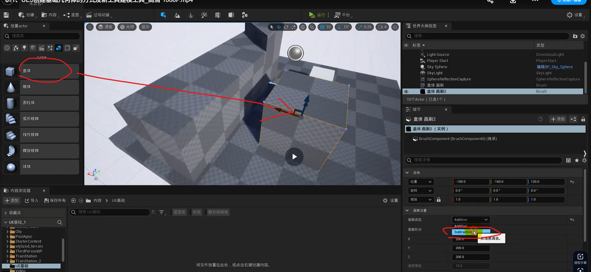
相减
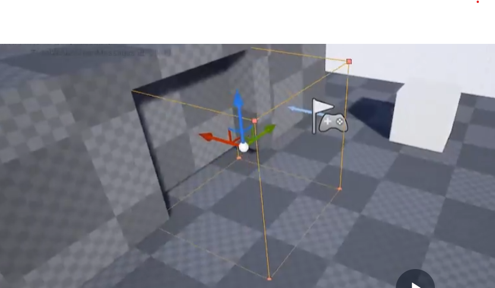
设置结构为默认
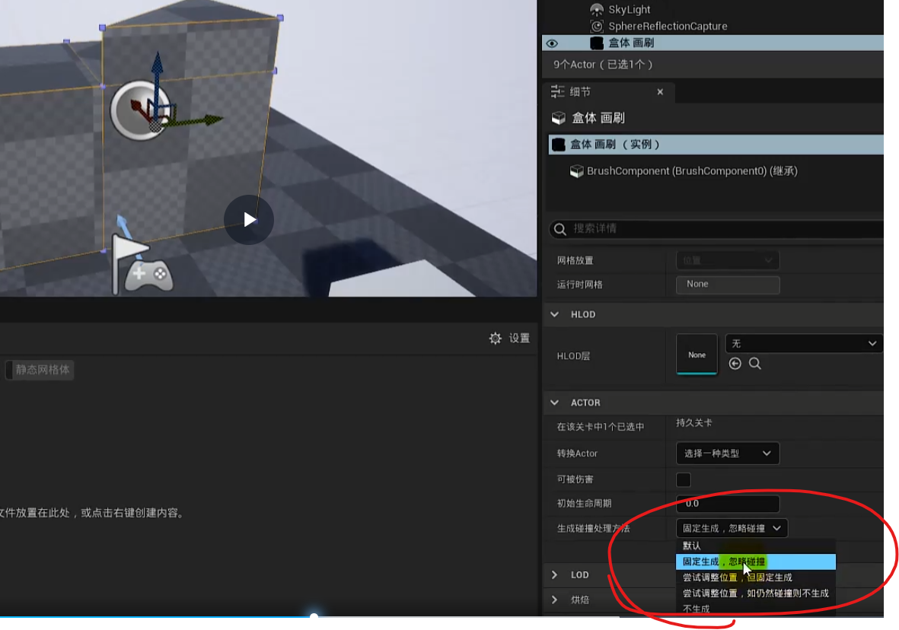
创建成为一个静态网格体
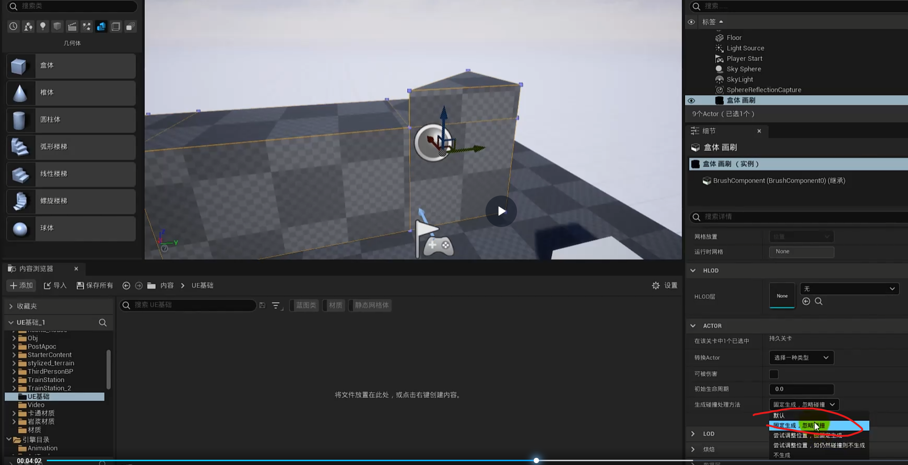
创建静态网格体

# ue对静态网格提进行编辑

打开编辑，插件选中这个，重启ue
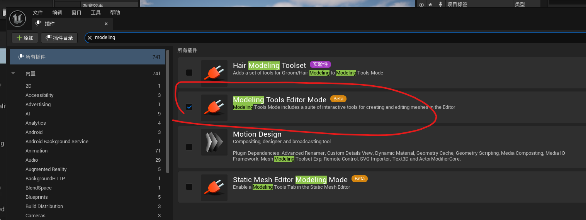

相当于小型maya搬到了ue
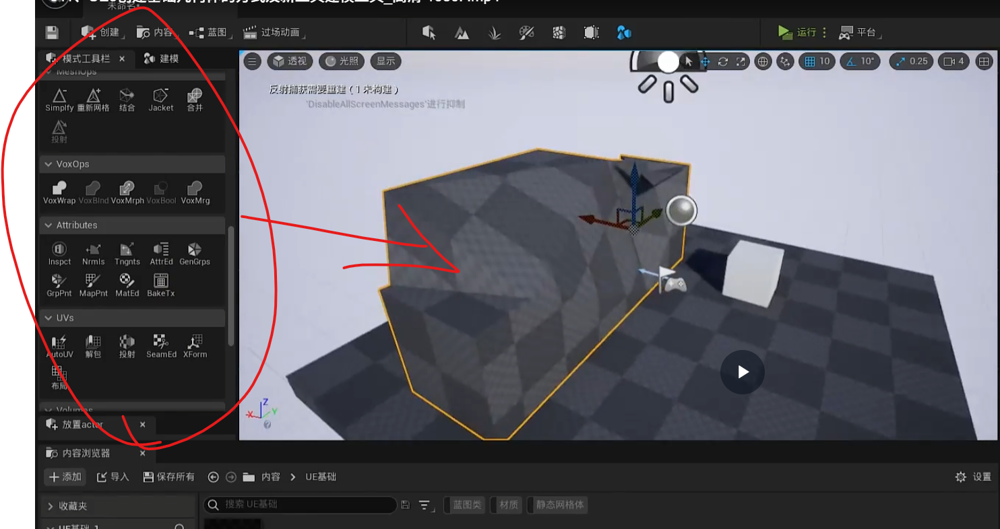

