# 创建空白的level  
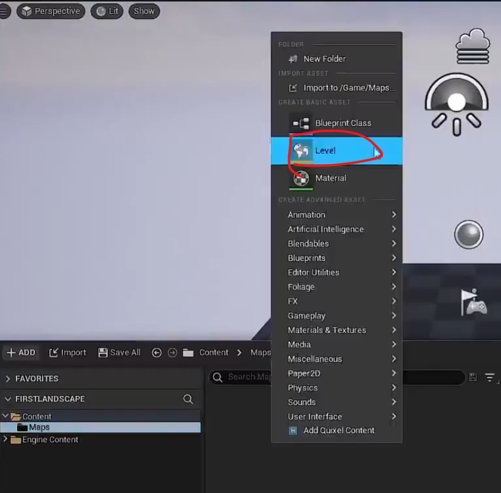

# 创建定向光
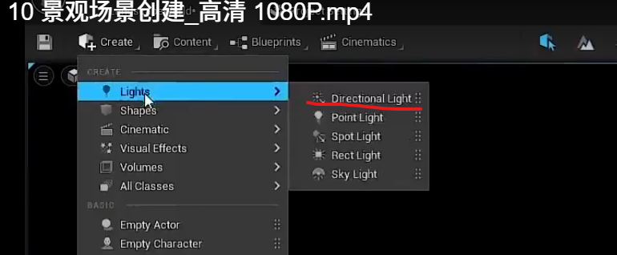

# 在这个level上面创建天空大气
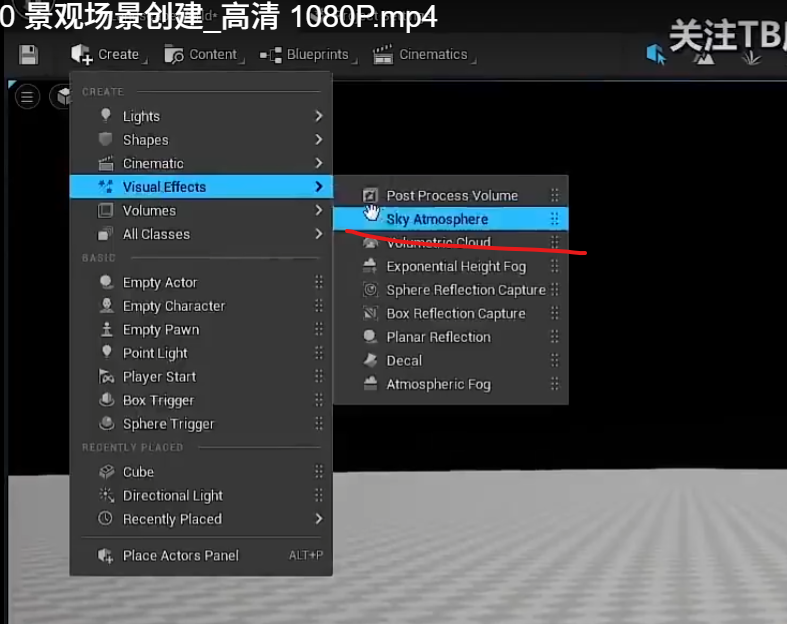
选择 sun light   
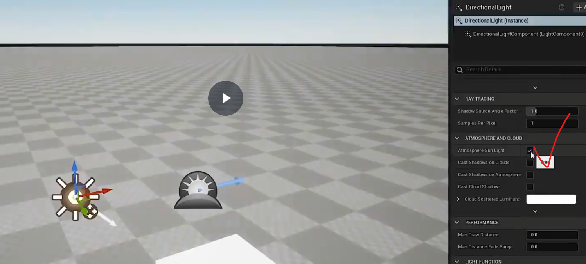
ctrl+L可以旋转  

# 创建天空光照  

设置成move  
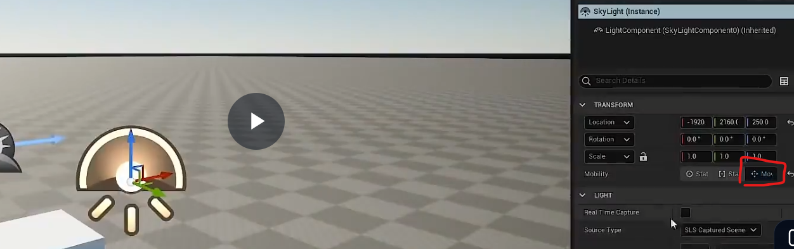
改成实时光照  

# 添加雾气
设置雾气之后，太阳下山，我们还会存在光照  
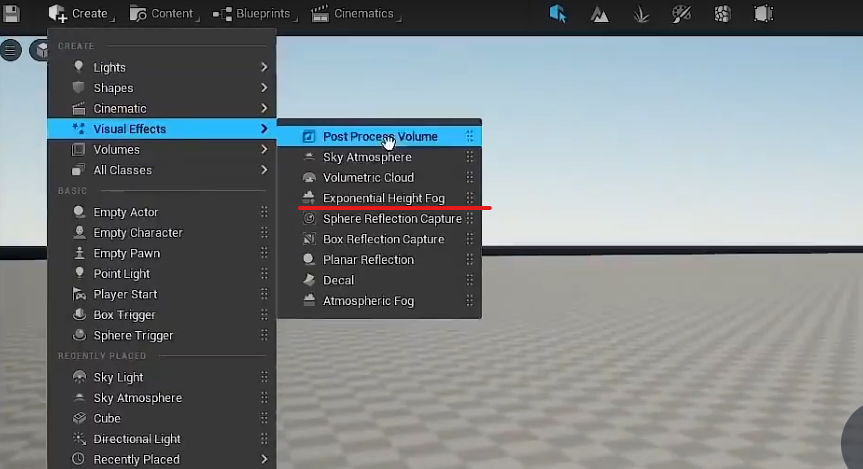
把这个给勾选上  
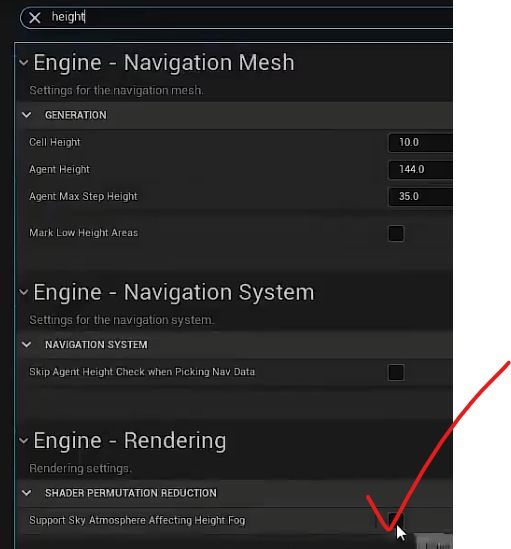

可以设置雾气为全部黑暗  
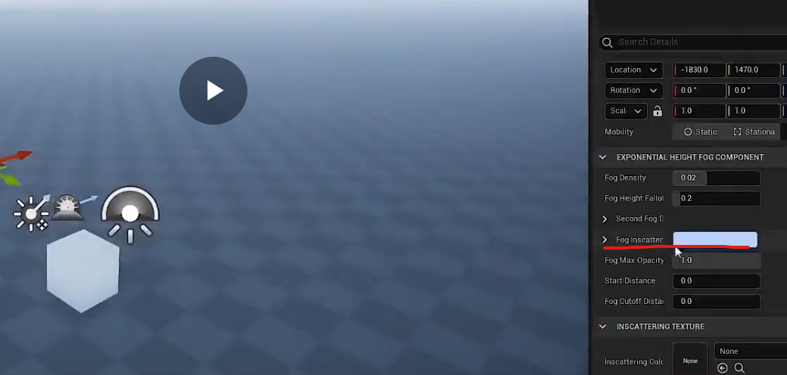
散射也要设置成黑色  
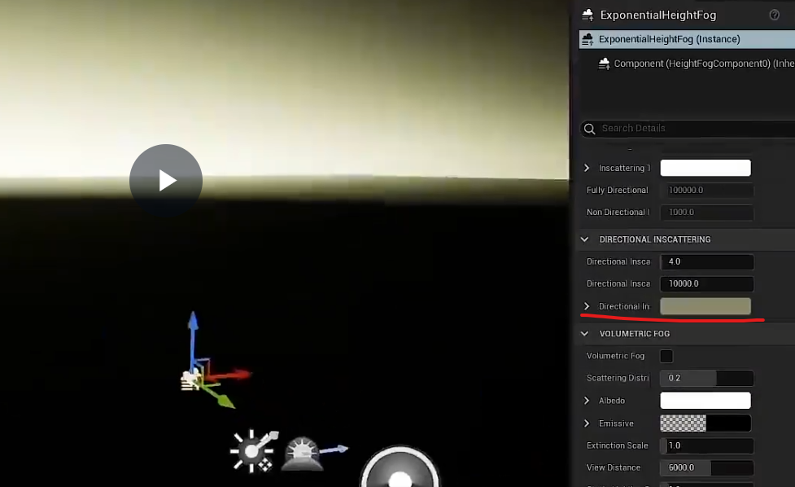

ctrl+L,太阳慢慢抬起来，看到阳光非常的好  
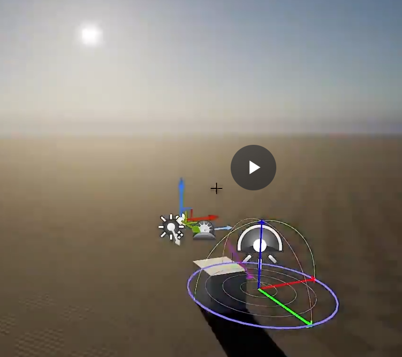
90%的室外打光都是这样  

还有就是可以调节雾气的高度  
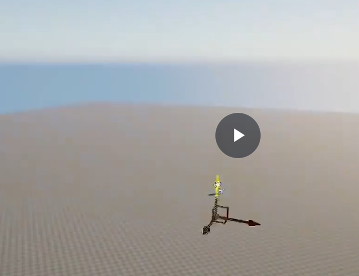
还有可以调整雾气的参数  
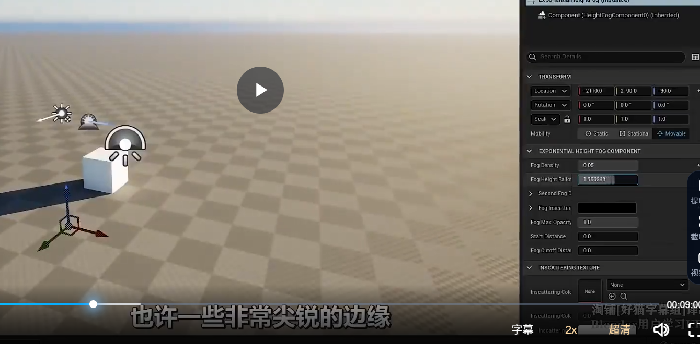

# 地图编辑模式
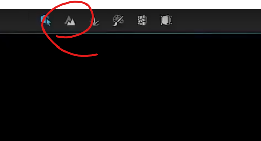
# 可以绘制地形
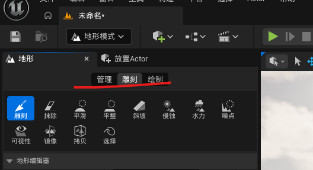
# 可以新增地图
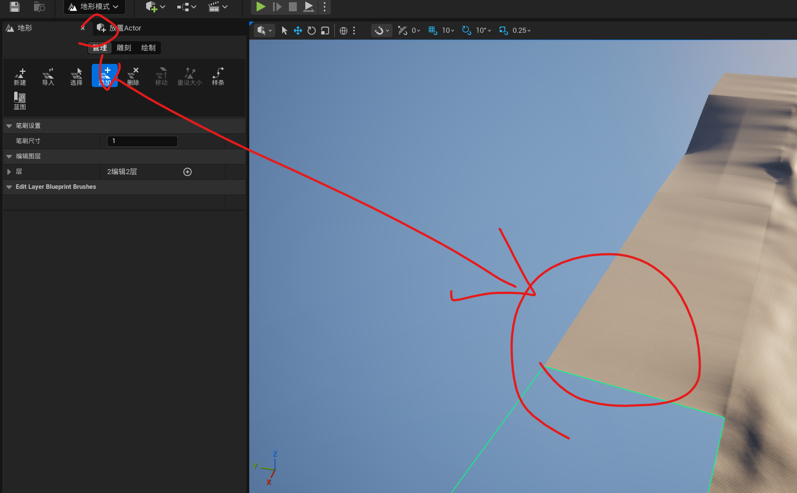

