创建文件夹，创建材质  
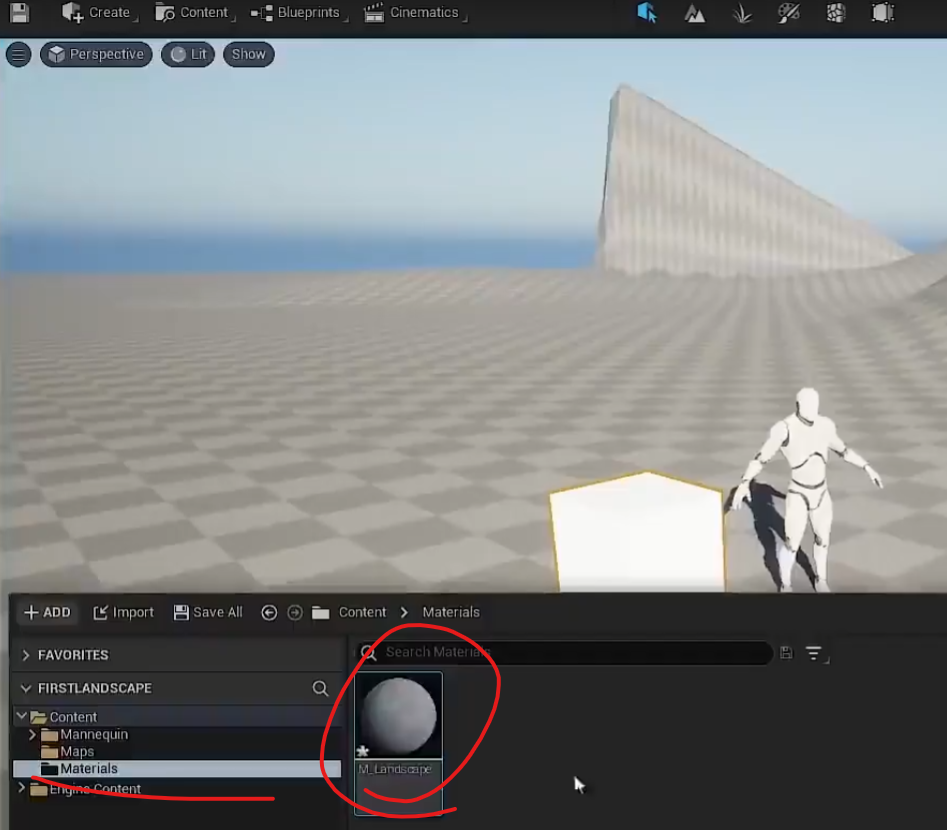

告诉虚幻引擎这不是普通的材质，这是一个风景材质  
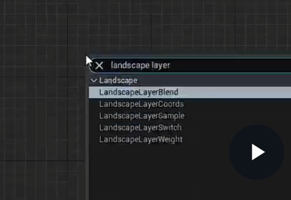

这里有个详细面板，不断点击加号  
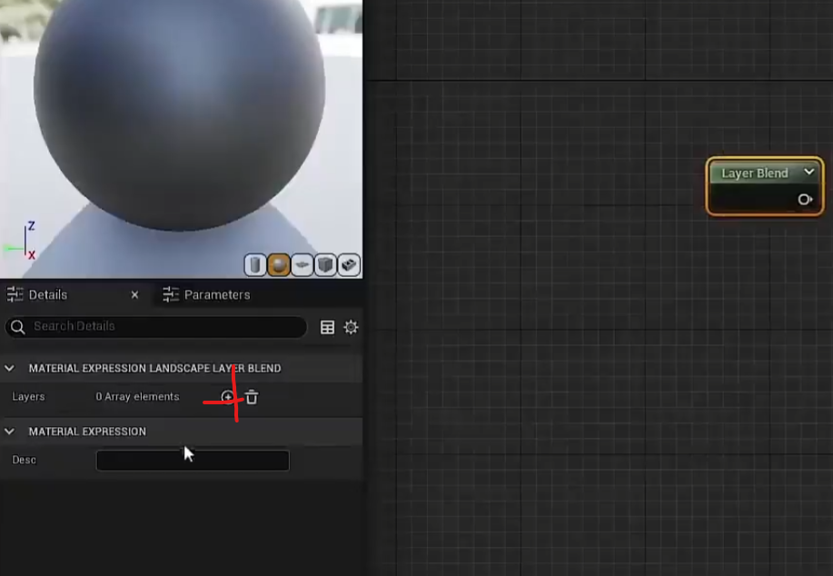

创建两个，草和土地，这个操作允许我们在同一个关卡中绘制不同的图层  
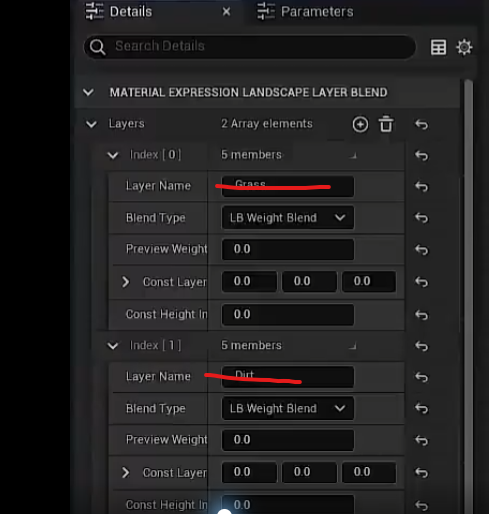
创建颜色  
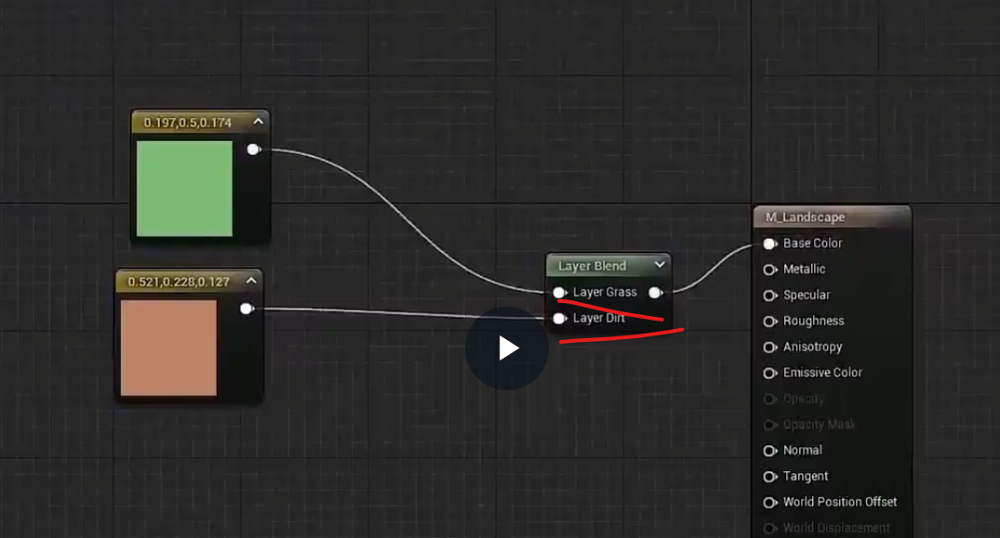

将材质拖到这里

然后变成了黑色
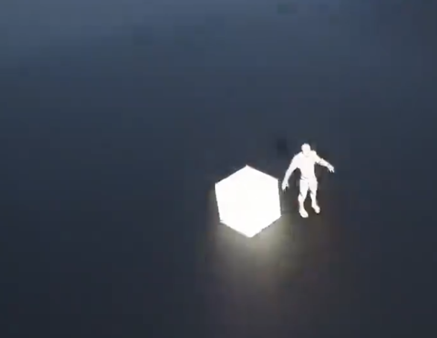

然后就可以画材质了  
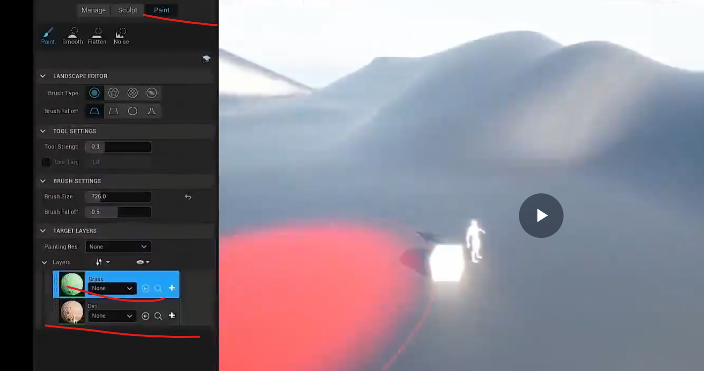

直接绘制图层会报错，需要先创建一个图层
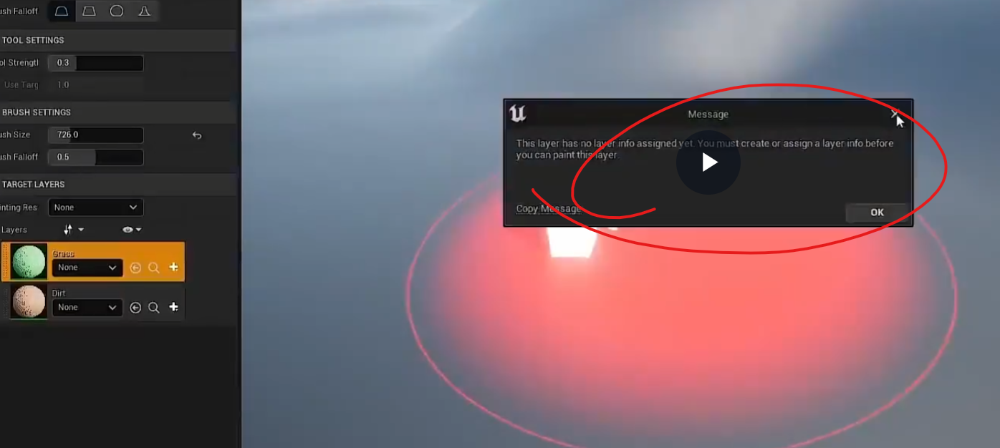

点击这个创建图层
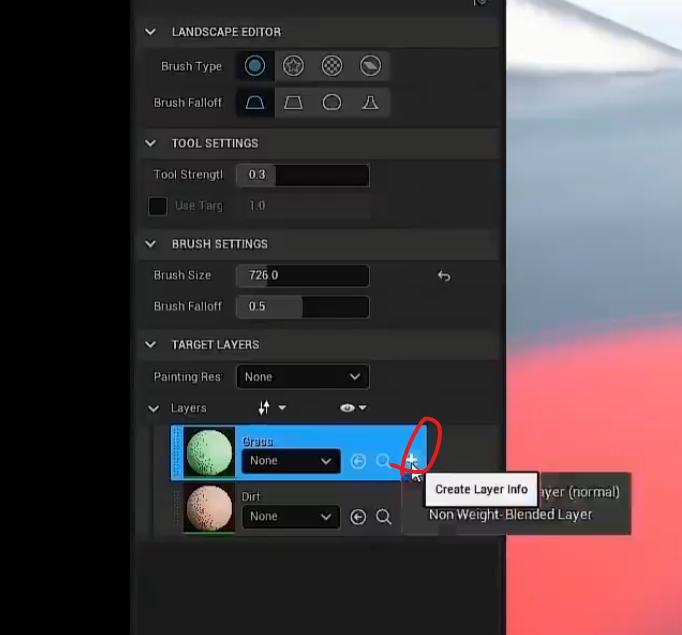

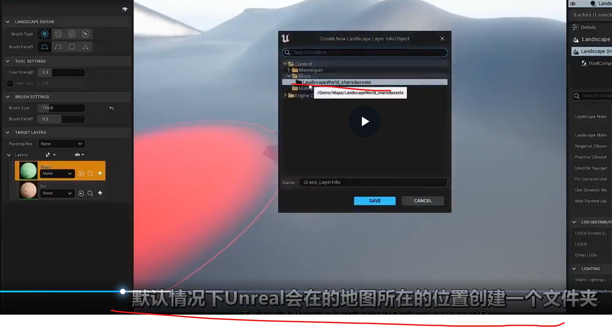

ue会自动创建两个图层文件夹
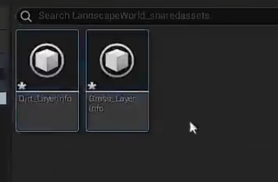

选择成图就可以直接绘制了
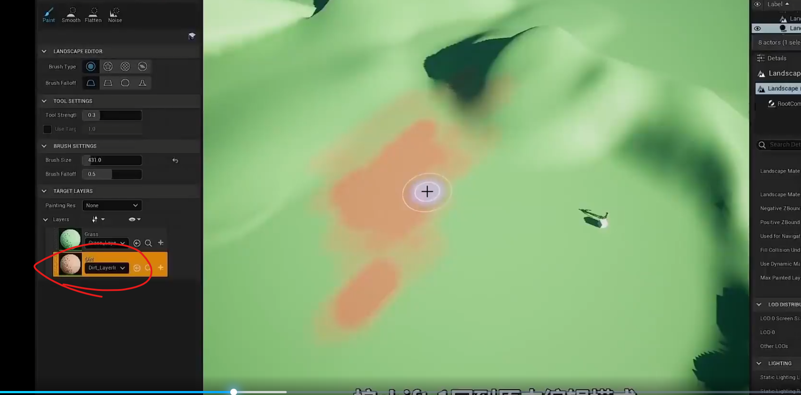

最开始是这种图层混合
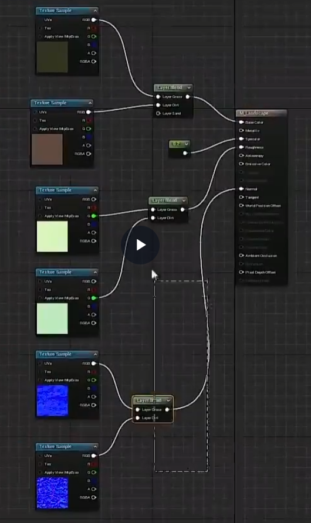

进一步优化
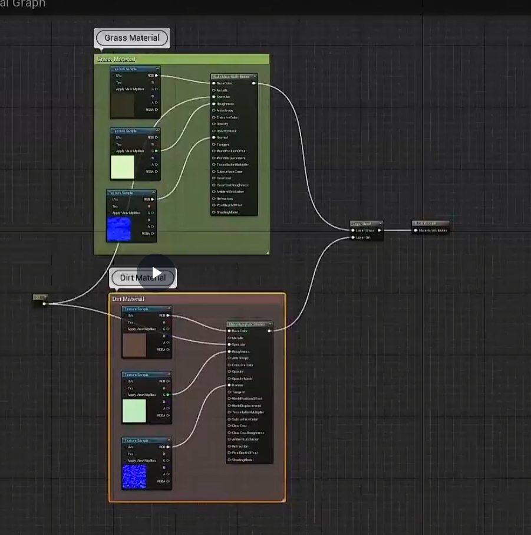

给材质添加纹理细节度量
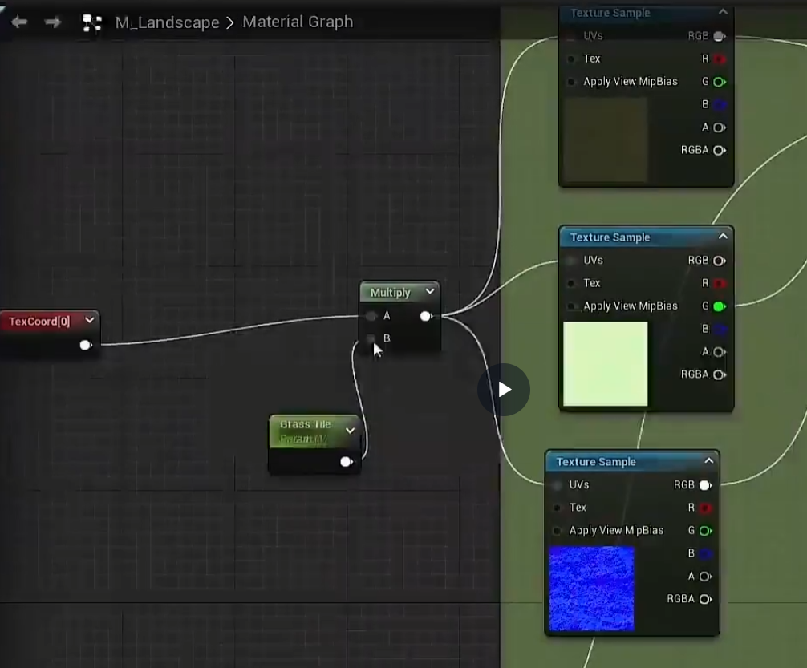
就可以调这些纹理细节了
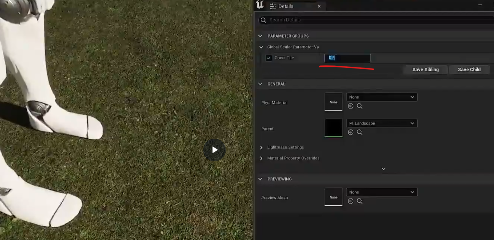
进一步吧
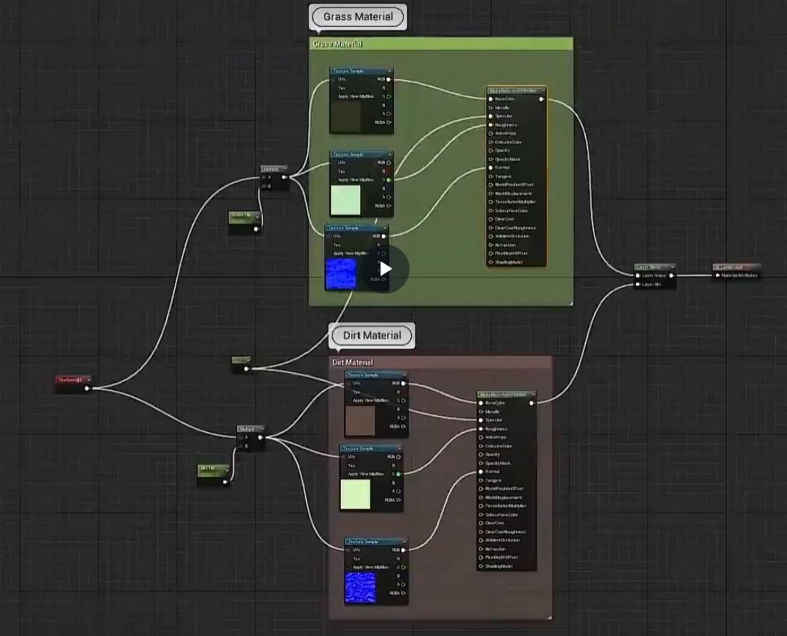
给每个图层加一个色调
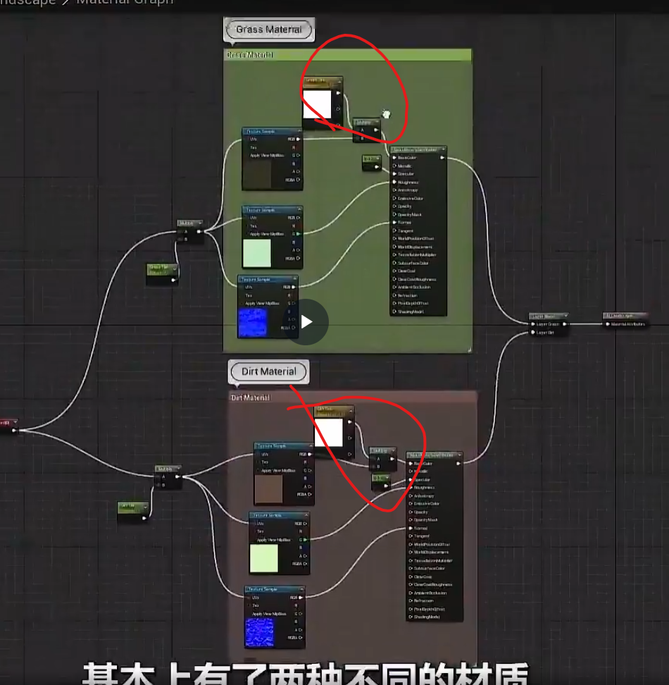

