# 11 创建第一人称角色 13 投掷物体

投掷物体  
1设置哪个物体  
2投掷的方向  
投掷的力度  
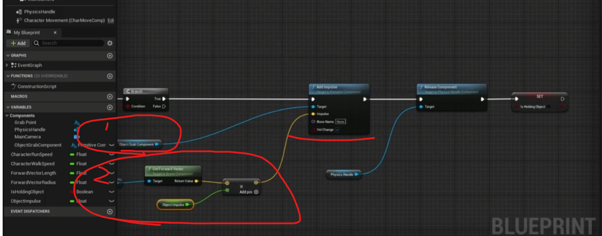

# 12 如何控制UE中的时间 01 时间线介绍

这里展示了下时间线和延迟的区别，但是时间线可以做更加多的事情  
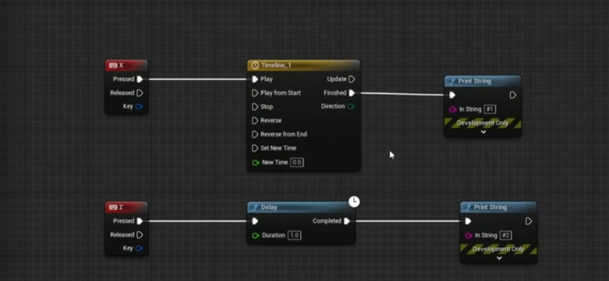

时间线可以输入连续输出值例如，0到1间隔0.1不断输出，用于动画的变化，添加很多连续变化的值  
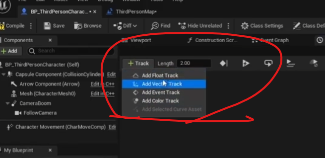

两秒  
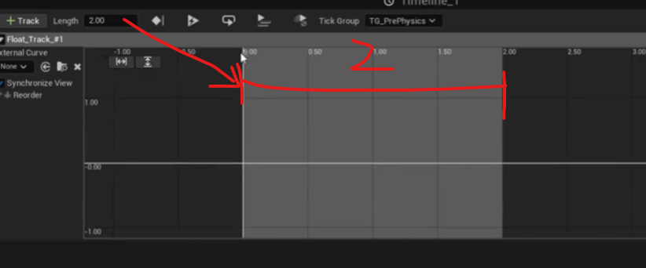

添加建，右键  
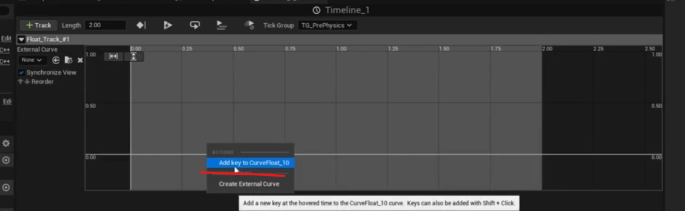

在什么时间，需要什么样的值  
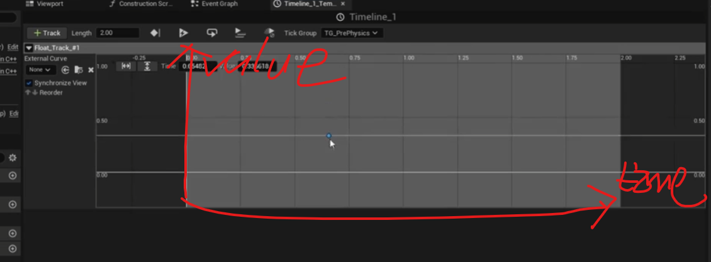

这里就是我们希望时间结束的时候，值为2  
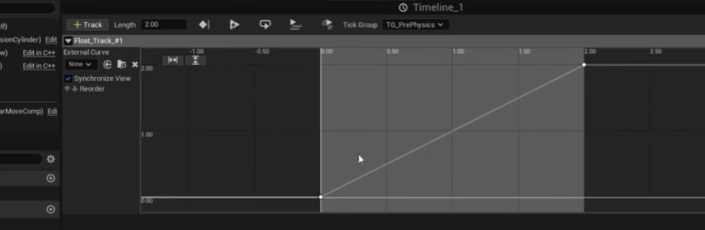

值更新的时候就打印  

可以看到数字不断更改  
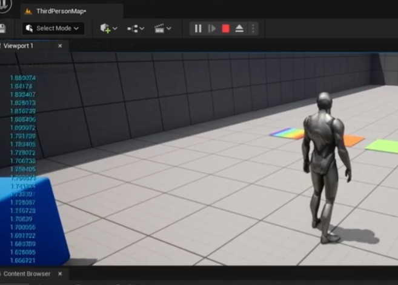

# 12 如何控制UE中的时间 03 时间线 - 矢量轨道

添加一个向量  

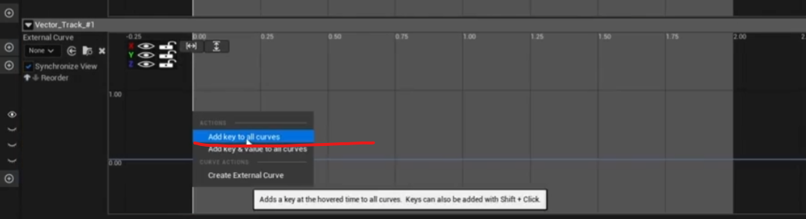

这里拉上来  
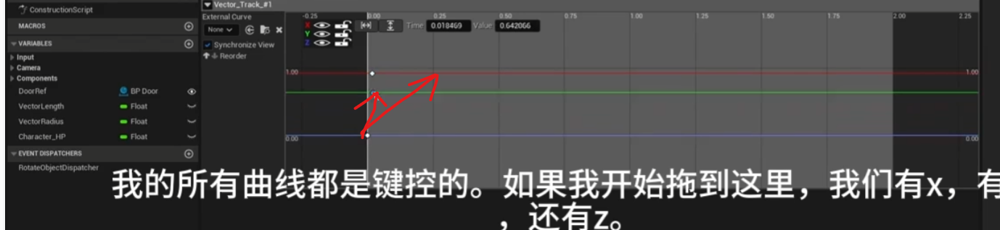

# 12 如何控制UE中的时间 04 时间线 - 事件追踪
每到一定的时间执行一次事件  
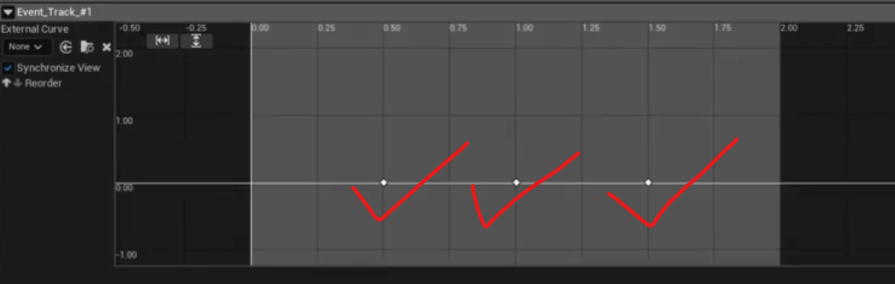

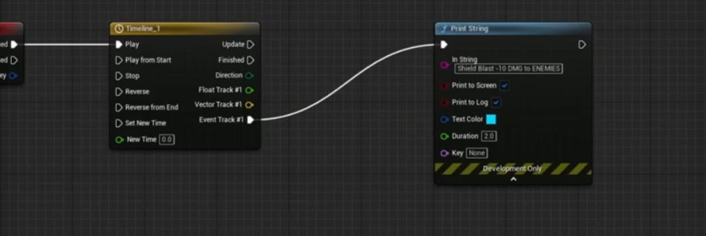

# 12 如何控制UE中的时间 05 时间线 - 彩色跟踪
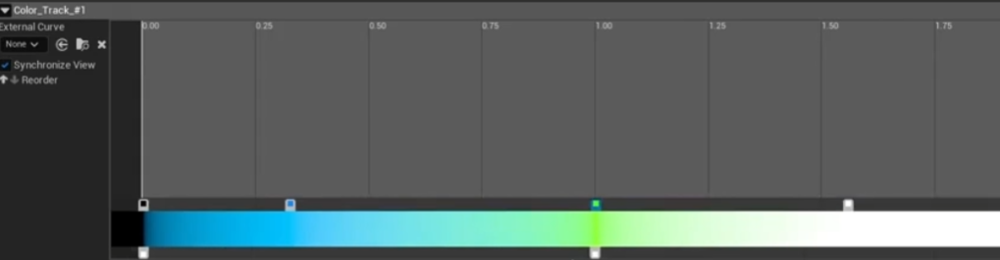

# 12 如何控制UE中的时间 06 时间线 - 浮动轨道运动

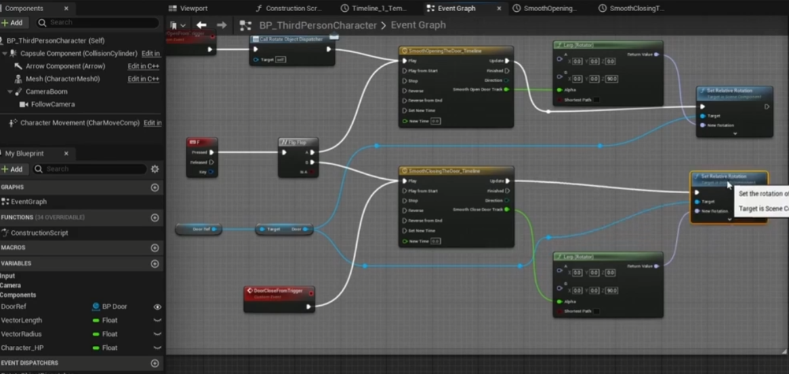

这里表示在一秒和两秒之间调用  
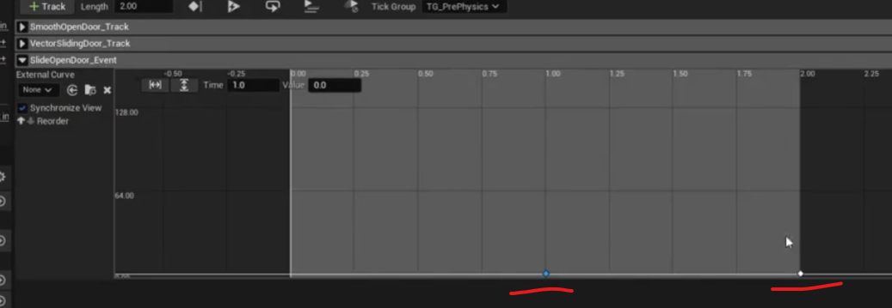

绑定到这个事件函数当中，哪些采取时间也是一段一段的执行  
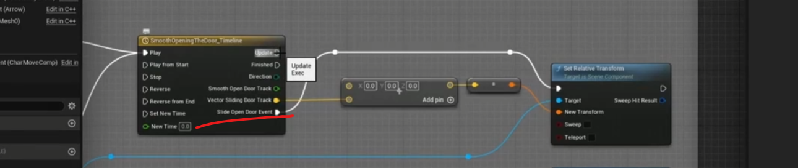

# 12 如何控制UE中的时间 09 时间线 - 颜色轨道材料

主要是学习在蓝图当中设置材质实例颜色，设置成可变  

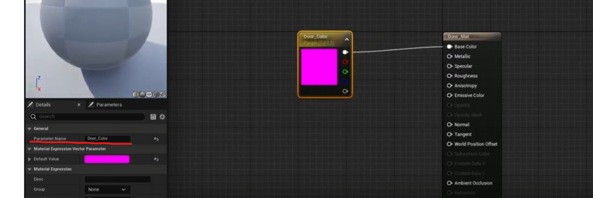
创建网格体的材质实例  
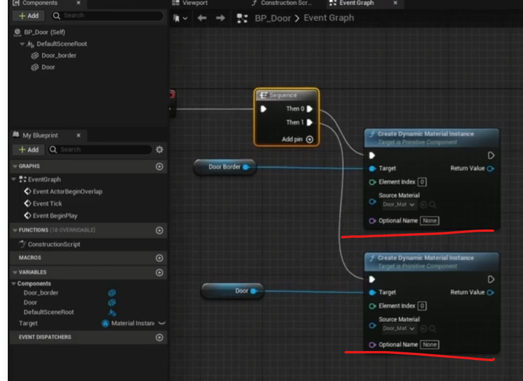
设置他们材质的颜色属性      
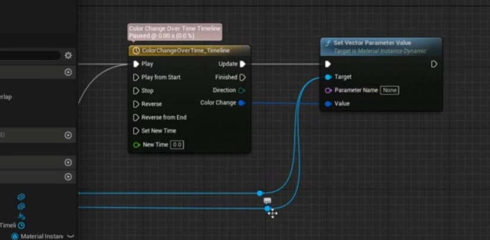

# 12 如何控制UE中的时间 10 时间线 - 曲线
两个点设置成auto，就会平滑很多  
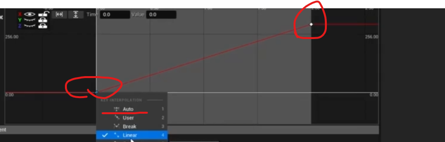

设置成常数  
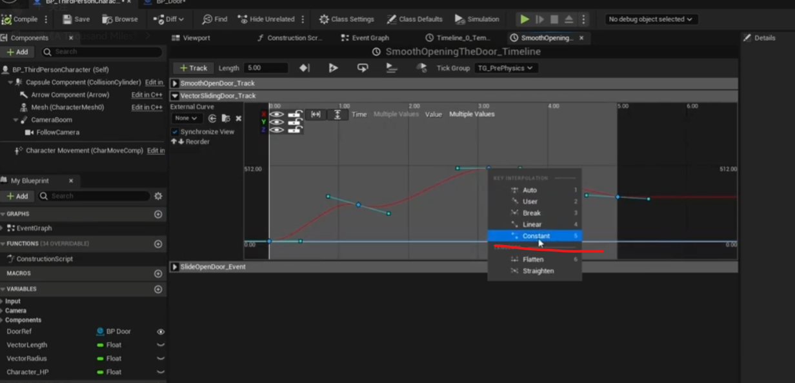

# 12 如何控制UE中的时间 11 时间线 - 自定义曲线

创建自定义曲线  
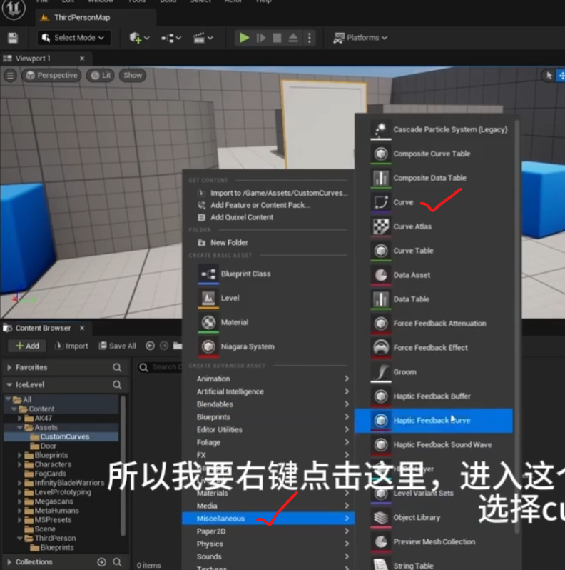

曲线  
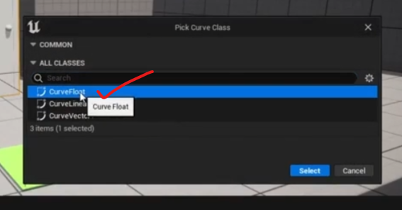

设置成auto  
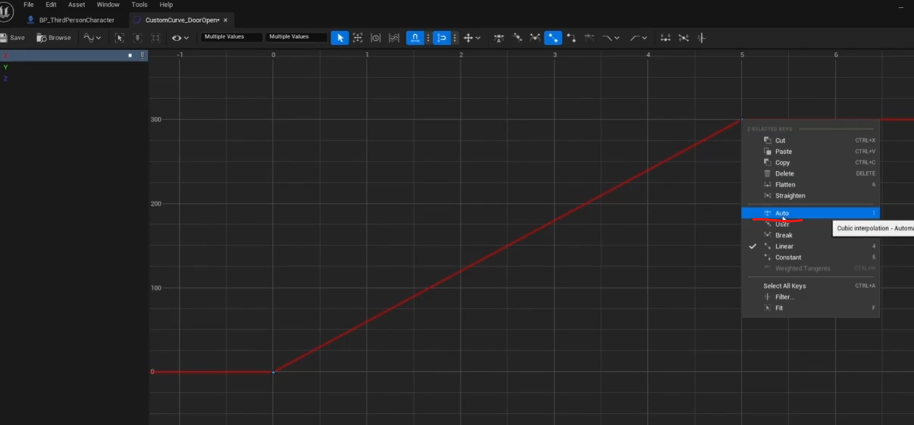

在曲线哪里选中它 
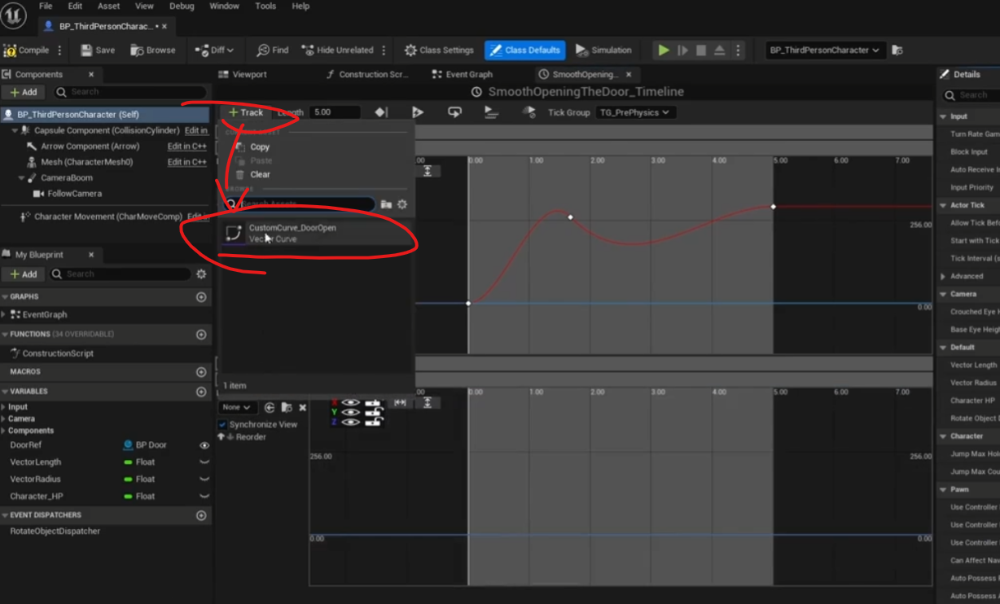

# 12 如何控制UE中的时间 12 时间线 - 循环

# 12 如何控制UE中的时间 13 时间线 - 长度

# 12 如何控制UE中的时间 14 时间线 - 播放位置

# 12 如何控制UE中的时间 17 时间线 - 输入

