# 12 如何控制UE中的时间 21 FPS和调试工具的解释
显示第一帧和第二帧之间的秒数  
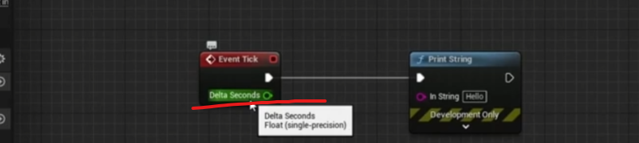

显示帧数  
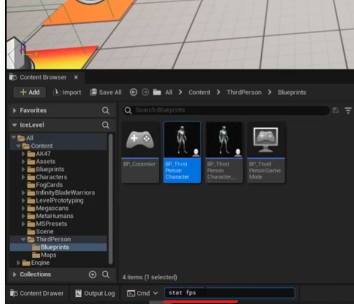

# 12 如何控制UE中的时间 22 Tick - 运动错误的方式·
这里讲述了使用delta time,用帧数控制动画移动是不对的，因为帧数有高有低，那影响动画的完成时间  

下面解决了这个问题， 帧数低，每一帧移动的距离就大，帧数高，每一帧移动距离就短  
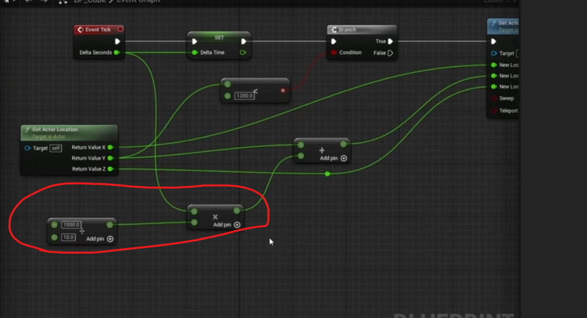

# 13 如何控制UE的空间 01 向量理论

# 3 如何控制UE的空间 03 通过蓝图进行向量计算
两个方块位置相减得到一个向量
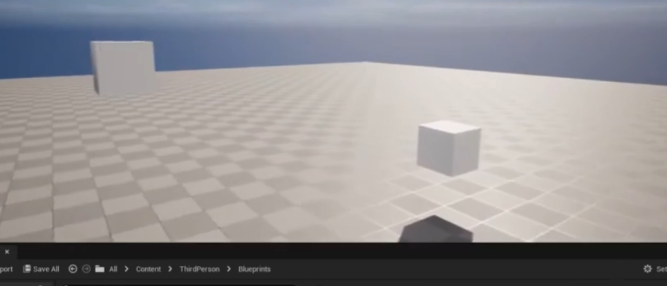

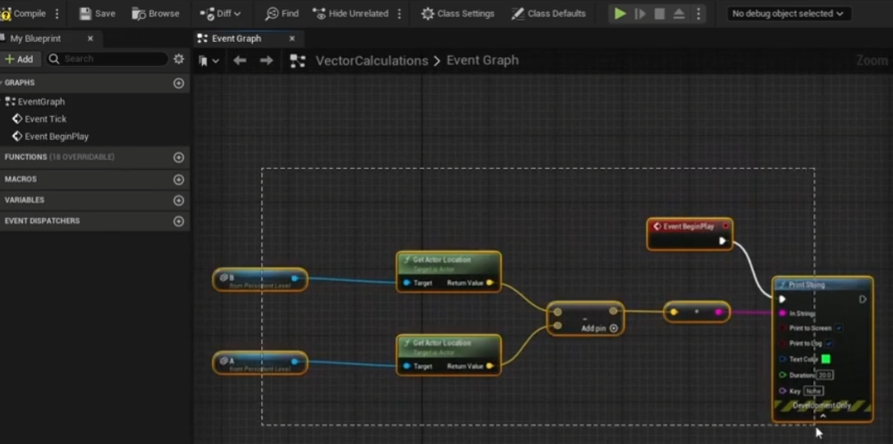

# 13 如何控制UE的空间 04 向量长度计算

原生提供计算两个方块距离的办法 
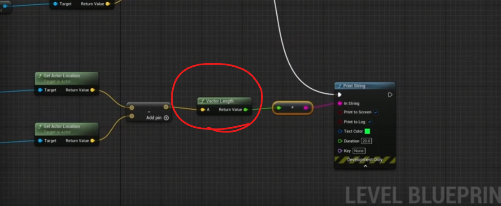

# 13 如何控制UE的空间 05 两个演员之间的距离

自带直接计算两个方块之间的距离，有好几种距离方法，水平距离垂直距离，自己去查  
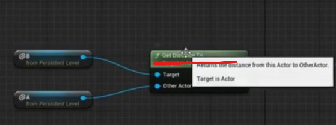

# 13 如何控制UE的空间 06 归一化向量 - 背后的数学

# 13 如何控制UE的空间 07 归一化向量

归一化工具函数，但是不知道归一化有什么用  
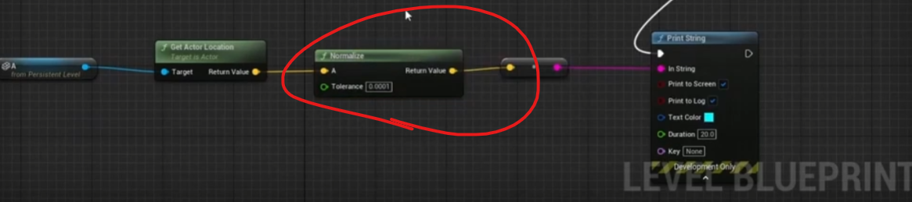

# 13 如何控制UE的空间 08 前进向量

主要是讲有两种向量，一种是角色相对于世界的旋转，一种箭头的向量是在角色内部的旋转。  
获取角色的方向向量x，y，z，每个值的范围是 -1 到 1  
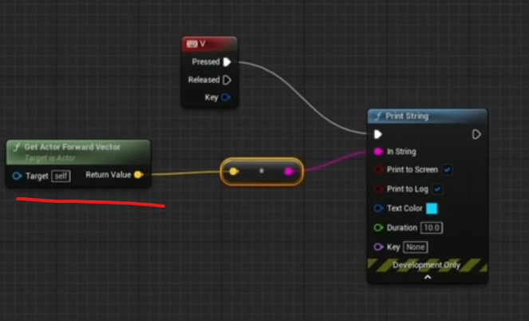

创建一个这样子的箭头组件

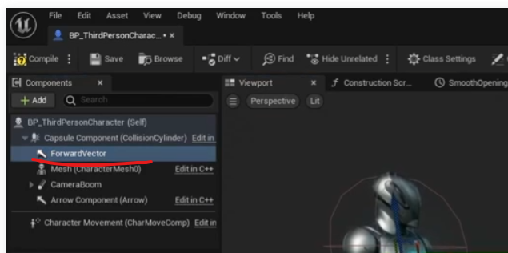

去掉勾选，可以显示出箭头  
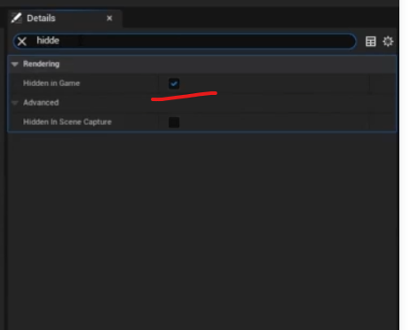

这个向量就是角色组件内部的向量  

# 13 如何控制UE的空间 14 速度

获取速度  

因为这是一个角色类，设置角色的移动速度  
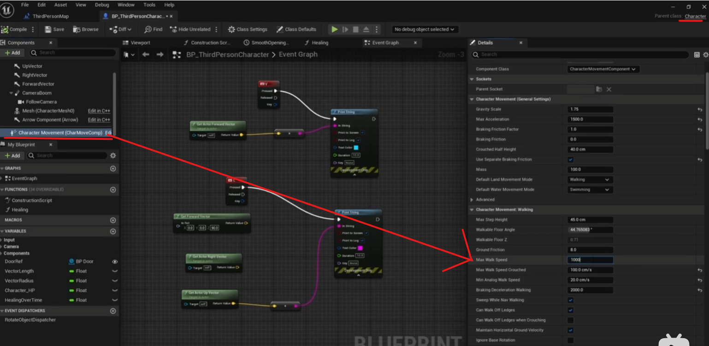

还有跳跃的速度  
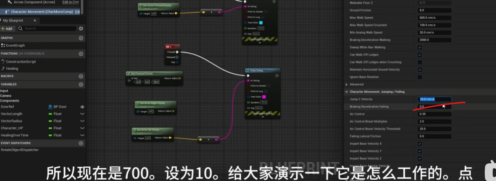

